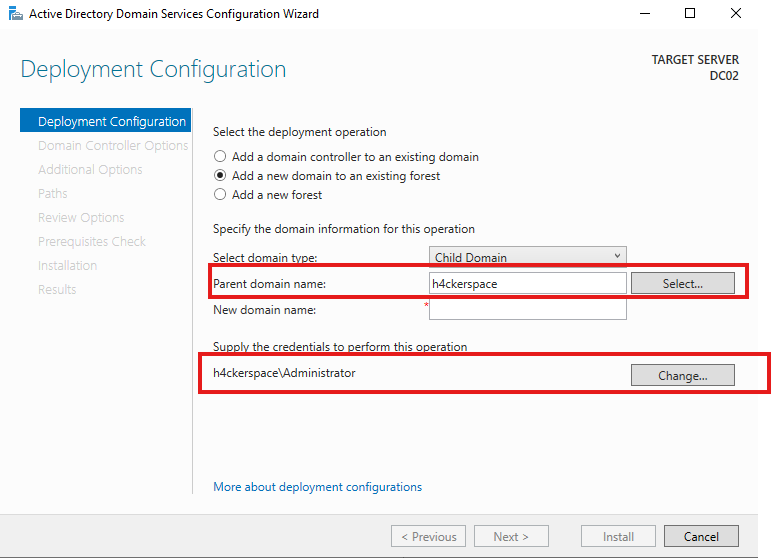
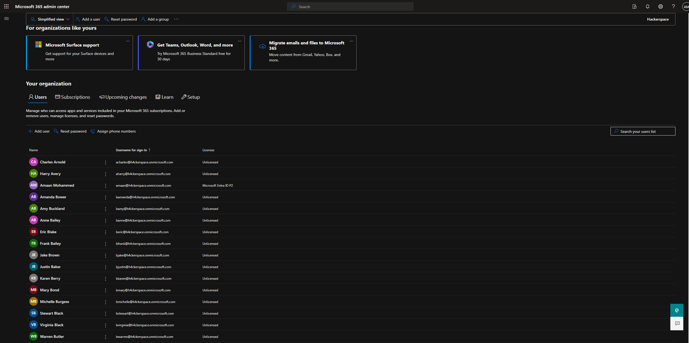

# CREATION OF CHILD DOMAIN AND MOVING THEM TO THE CLOUD USING AZURE CONNECT

# Architechture of the setup:

Here is a simple diagram illustrating our setup:

# Creating domain controller and adding them to the root domain :
So As we have created our Domain controller, workstations, users, groups in our main domain controller. Now lets see how we can join another domain controller to our forest and Move this forest to the Cloud Microsoft Entra ID (Previously known as Azure AD and before that known as Active Directory). So taking a base server and installing a GUI Based Windows server on it and we can configure that by using our previously mentioned repo.

Once we have installed the server and changed the network configuration of our DC02 by pointing it towards our Domain Controller01 (DC-01) and installed the needed Active Directory Services and Management tools from the server domain but after doing this we will configure and select the notifications on the top right section of the server manager console and select the Option of "*Make this a Domain Controller*".

* Once we have done that we will select the option of *Add a new domain to an existing forest*

* Select the domain as *Child Domain*

* We will provide the credentials of our root domain and the system will automatically search our domain and select it.

* We will give the name of this child domain. In Our case I am putting it as 'Eu' and click next.

* Keeping everything the default and providing the password for this child domains administrator.

Once we Complete all the steps and install the AD Services on our child domain we can see our DC02 in the root domains Active Diretory sites and services console under the EU Site that we have created.

and we can see out EU\Administrator Configured

* Using our random user generation powershell script we will be creating another 50 users for this domain and adding them to random groups so this way we know that there are users and groups in this domain too.
* Once we are done executing the code and out users and groups are created we can see them

# Moving the Domains to Cloud using Azure AD Connect.

Moving ahead we will first have to create our Entra ID with microsoft Entra ID. You can access the link below to have a free 1 month subscription and use it for educational purposes like I did.

https://www.microsoft.com/en-us/security/business/identity-access/microsoft-entra-id

Additionally we will be installing Azure AD Connect on our respective Domain Controllers and use them to upload our DC to the cloud.

* We might encounter some minor failures here and there while we are setting up the AD Connect. One of them that I faced was TLS 1.2 not being enable on the server to communicate with the microsoft website.

I followed the Link below from microsoft's documentation and ran the scripts and it worked just fine without any errors and we could move ahead.

We will go ahead with the Express setting where the Azure AD Connect will automatically configure itself and upload our data from both of our DC's to the cloud we will just need to provide some of our info.

* In this we will provide the microsoft id that we will accquire when we register for the Entra ID and start our free trial.
* Next we will give our AD Admin credentials of our DC 

In this we can see that it automatically takes our child domain as well and is ready to upload it to the Cloud enviornment.

Accept all and we go ahead and install it.

* Once the sync is done we can now login to our Entra ID and see our users and groups available.

We can see our Domain details in our microsoft entra admin center

And thats how we can join our on premis Active Directory to the Azure Entra ID. 

For us to setup the Azure connect such that the user can login from anywhere using their new azure cloud ids and their on-premises password technically speaking the SSO mehtod. We will need to configure the AD Connect and isntall teh configurations and enable the password hash syncronization, password writeback, group write back so that when we make any necessary changes in the cloud it is synced with the on-premises domain as well.

Once the synchronization is done we can login using the azure given UPN and get logged in the system.

We will be successfully logged in the workstation.

# Note:
I faced an issue while I was trying to login as we created a child domain we need to setup our DNS query such that even if we try to point our on premises workstation only to the main DC we will be able to login with the child domain user credentials too.

* For that we need to create conditonal forwarders in our main DC and child DC. looping together such that the above mentioned statement is configured.

