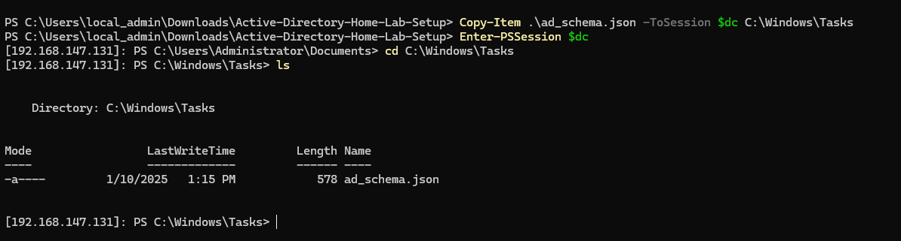

Creating user using powershell script and trying to create a vulnerable active directory machine such that we can later try to use the vulnerabilities and exploit these vulnerabilities from the Parrot OS machine and see hwo the system reacts to these vulnerabilities. 

The major reason of creating this repository is to understand how the AD works and how the machines are compromised by the avaialable vulnerabilites out there. 

To create the vulnerbale machines we will be using a pre structured github repository which many might even know about as well as learned from it is **https://github.com/safebuffer/vulnerable-AD**

We will use the above to create the vulnerable environment but do some of our own minute changes and see how the system reacts to these changes and we shall work our way around on how to attack those changes.


I created the "./ad_schema.json" file and created a group of software developers and a single user name Jason Bourne and gave his username, password and email id for our domain. 

Lets try to get this file on the other side of the domain controller and through the managemnet console that we created earlier and use it in the domain controller to create the user and the group.

We can copy the file by the using the command 

```shell
Copy-Item .\name_of_the_file -ToSession $dc *Path of the folder you want to paste it*
 
 
 /// in my case ///

Copy-Item .\ad_schema.json -ToSession $dc C:\Windows\Tasks

```
*Note: where in $dc is what i wanted my PS remote session of the domain controller to be.*




