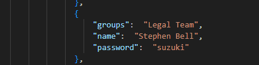

We shall be creating a powershell script to generate random users and define some groups taking some help from the previously mentioned github repositopry of vulnad. We shall use some of their code as well as tweak it here and there according to our feasability and see how things change and learn accordingly

Lets get fired up and we shall create a random.ps1 file where in we will be writing our code to generate random users and adding them to the some groups.

I created a text file names groupnames.txt and added some common groups that might be present in an organization. And copied some random first names available on any github repositories and made a txt file of that firstnames.txt similarly creating a last name text file as well as passwords text file lastnames.txt, passwords.txt

So to get started with the code part after we create those files we tried to get a random group name by using the (Get-Content) & (Get-Random) commmands and using the files we created and tried to get a random group names from it 


Now to have somthing unique and if in case we needed to remove any thing from the list we can do it easily using the 
```shell
[System.Collections.ArrayList]
```
It provides a dynamic array that can grow and shrink as needed.


# Initialize Variables
Two empty lists, $groups and $users, are created to store the generated groups and users.

# Create Groups

The script creates 10 random groups.
For each group, a name is randomly picked from groupnames.txt, added to the $groups list, and removed from the available options.

# Create Users

50 random users are created.
For each user:
    -A first name, last name, and password are randomly picked from the respective lists.
    -A group is randomly assigned to the user.
    -The user’s details (name, password, group) are stored in the $users list.
Once selected, the names and passwords are removed from the available options to avoid duplication.

# Output Results

After generating the groups and users, the script outputs a structured summary:
Domain: The domain for the environment (hackerspace.com).
Groups: A list of created groups.
Users: A list of users, each with a name, password, and group membership.


But when we run the code and check it at our domain controller we see that there are a lot of errors because of the default password complexity set on the Group policies.


To fix this we will turn off the password complexity by creating a function in our ad.ps1 file and in the fucntion we will give set the password complexity off using the powershell command by creating a temporary config file and edit its password complexity from 1 to 0 and force it to the system. 

```shell
function WeakenPasswordPolicy(){
    secedit /export /cfg C:\Windows\Tasks\secpol.cfg
    (Get-Content C:\Windows\Tasks\secpol.cfg).replace("PasswordComplexity = 1", "PasswordComplexity = 0").replace("MinimumPasswordLength = 7", "MinimumPasswordLength = 1") | Out-File C:\Windows\Tasks\secpol.cfg
    secedit /configure /db c:\windows\security\local.sdb /cfg C:\Windows\Tasks\secpol.cfg /areas SECURITYPOLICY
    Remove-Item -force C:\Windows\Tasks\secpol.cfg -confirm:$false
}
```

Reverting back to our original Domain Controller snapshot where we did not create any AD users as such so we can have fresh start (Thats the reason why always have your majorly changed VM snapshotted ) and copying all the files that we require from our management console to the Domain Controllers end. 

We run our ad.ps1 file with the newly created json file that we get when we run our powershell code of creating random users and groups.
And accordingly we see that the domain controller has created random groups and users. 


We will login from one of the user acccounts into the workstation VM and check if we get into it or no. I am using the user Stephen Bell who is from the legal team 



And we are in successfully


**And Thats how we have created random users and added them to random groups by disabling the password policy complexity.!!!!**
