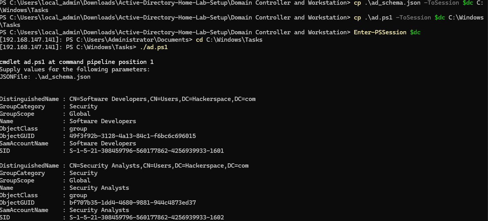
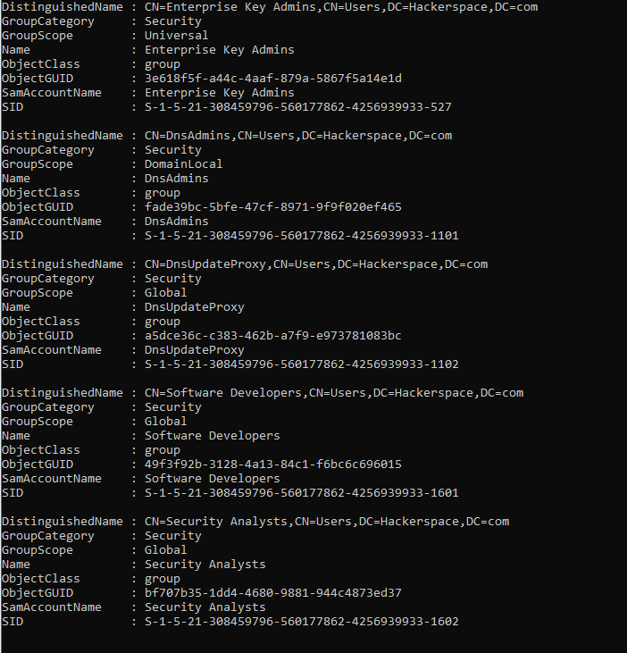
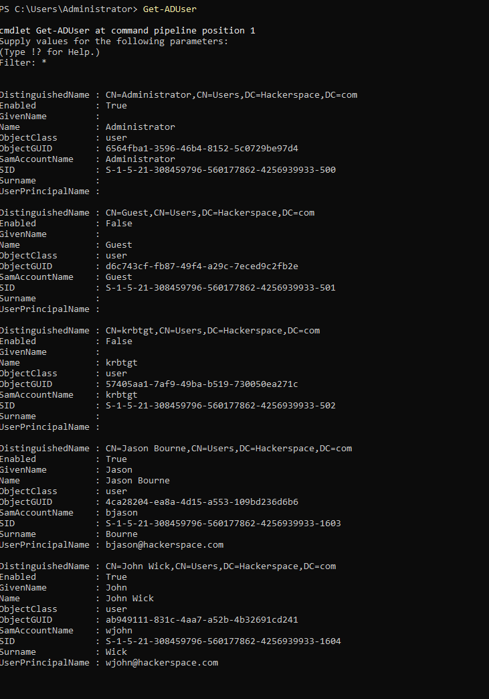
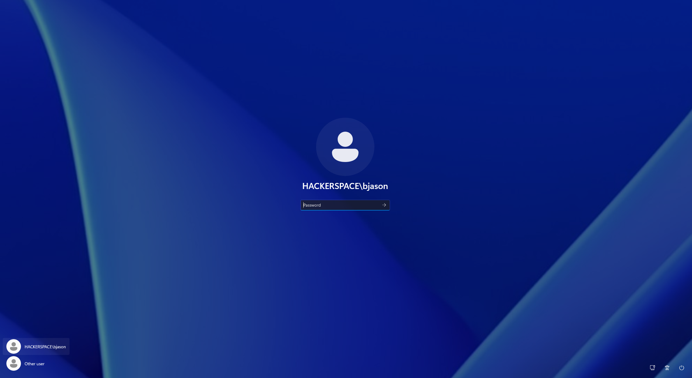

Creating user using powershell script and trying to create a vulnerable active directory machine such that we can later try to use the vulnerabilities and exploit these vulnerabilities from the Parrot OS machine and see hwo the system reacts to these vulnerabilities. 

The major reason of creating this repository is to understand how the AD works and how the machines are compromised by the avaialable vulnerabilites out there. 

To create the vulnerbale machines we will be using a pre structured github repository which many might even know about as well as learned from it is **https://github.com/safebuffer/vulnerable-AD**

We will use the above to create the vulnerable environment but do some of our own minute changes and see how the system reacts to these changes and we shall work our way around on how to attack those changes.


I created the "./ad_schema.json" file and created a group of software developers and a single user name Jason Bourne and gave his username, password and email id for our domain. 

Lets try to get this file on the other side of the domain controller and through the managemnet console that we created earlier and use it in the domain controller to create the user and the group.

We can copy the file by the using the command 

```shell
Copy-Item .\name_of_the_file -ToSession $dc *Path of the folder you want to paste it*
 
 ```
 in my case

 ```shell

Copy-Item .\ad_schema.json -ToSession $dc C:\Windows\Tasks

```
*Note: where in $dc is what i wanted my PS remote session of the domain controller to be.*


Just to test around and follow the video series I tried the same code but changed the values and added an email to the ad_schema.json file


Now creating our own powershell script and trying to see automate and create an AD user we use some commands from online and try it out 


Looking into the "VULAD" github repository we shall try to take the adding user powershell script, but before that I wanted to try the name to be split as "last initial.firstname" conceptual based so I give the command as 

```shell
 ($name[6] + $name.Split(" ")[0]).ToLower()

 ```
 where in it takes the first inital from the last name and keeps the first name as is and converts the whole thing to lower case 
 

 Now lets use this as to give the username to the AD user.

I do not but I just tweeked a little bit here and there and tried to work around with the video and added the first name and last name in the Create user function and and we used the same command above and made the name of the user be used as the first name and last name.


using the VULNAD repository we shall insert the command to get the Activer directory user started.


Now in the principal username to define the "$Global:Domain" we need to set the domain in our schema file wherein we can add the domain name. You can give it whatever you named your Domain controller DNS name as

```shell
"domain": "hackerspace.com",
```
Intrestingly I added another named John Wick (":P") in our schema file and set the name password and we added him to the Security Analysts group


Now creating a Group in the Domain Controller we shall follow the command given in the vulnad repository and use it. we created the necessary functions and commands that we would require to let the domain controller create the groups and add the users to their respective groups.


I haven't still run this code in the domain controller  but just putting it here just for documentation.

Lets take these files to our Domain controller and see how it goes on the other side.

Once we get our schema and ps1 file on the domain controller lets run it through.

To run the ps1 and giving our schema file as an input to it 

```shell
    .\ad.ps1
    .\ad_schema.json
```
We can see that the groups are created and both our users are added to their respective groups.



When we give the command Get-ADGroup and put the filter to * we can see the groups that we created


and when we give command Get-ADUser and set the filter to * we can see our users have also been created 

 
 We Then try to login in the workstation with the newly created users and we got our success.!!!
 