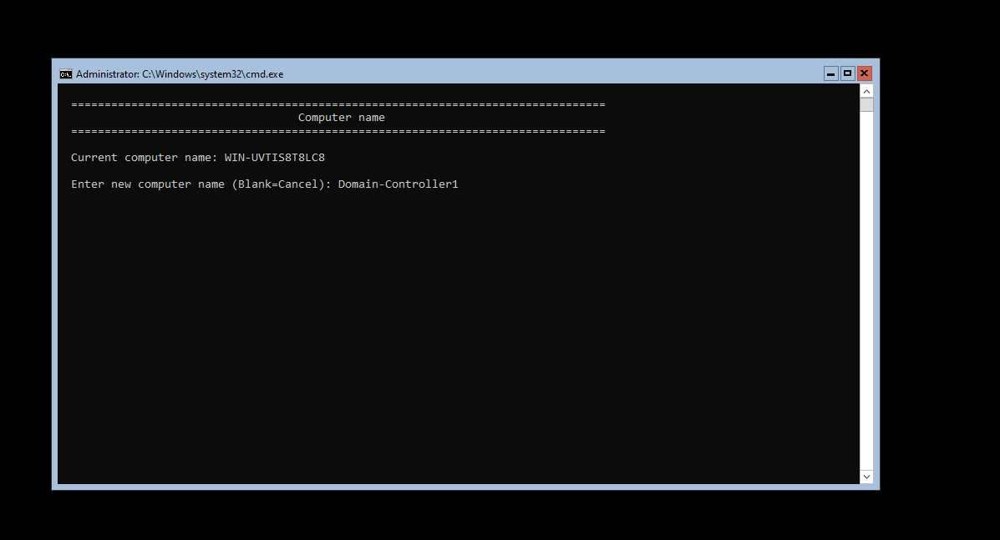
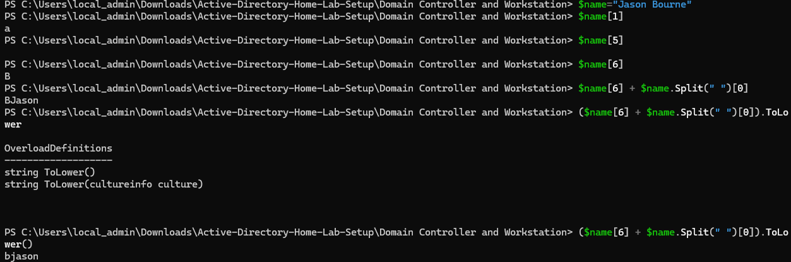
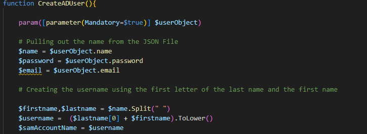
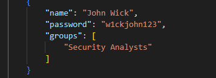

Today we did
Cloning the Server and workstation and setting one of the server as domain controller and the workstation as a management console and enabled PS remoting

Added the created domain controller as a trusted host from the management console and configured the WinRM of the domain controller and entered the PS session remotely from the management console

link for more documentation on how to add a server to a server manager using trusted hosts https://learn.microsoft.com/en-us/windows-server/administration/server-manager/add-servers-to-server-manager


Starting the New Powershell session after adding the domain controller to the management server and logging in using the DC login credentials


Setting up Active Directory on the server 
 Link that I followed: https://xpertstec.com/microsoft/microsoft-windows-server/how-to-install-active-directory-windows-server-core-2022/

following the link we know that we have a wierd name for our server so we will change that name of the computer by switching back to our Domain controller terminal and uisng sconfig and selecting the option of Computer Name and changing it as **DC-1** 



Now we change the network settings in our domain controller accordingly using sconfig and choosing option 8 as we need to keep a static IP address to our network before setting up the AD. 


changing the address to static and keeping the default gateway as is


We will configure the DNS Server in the same Network settings using the sconfig and let the IP be the same as we want the Domain Controller to be at the top

Installing Active Directory Windows Feature in the Domain Controller
```shell
Install-WindowsFeature AD-Domain-Services -IncludeManagementTools
```


Importing and Installing Active Directory Forest
```shell
import-Module ADDSDeployment
Install-ADDSForest
```


Naming the Domain whatever we wish to (I named it Hackerspace.com) and set the password, I kept the same password as the one for the base server in our base server setup(You can change it if you want to).

When the installation happens the DNS server address is resetted so we will need to change that back and will need to configure it using the command
```shell
Set-DNSClientServerAddress -InterfaceIndex 6 -ServerAddresses 192.168.111.155
```
You will need to check your interface index of your DNS using the command
```shell
Get-DNSClientServerAddress
```
With that we have our Hackerspace domain created at the bare minimum. Once  all the computer settings are applied to the Domain controller we will clone this and keep it just in case anything goes upside down we do not need to worry.:P

Next lets create a Workstation so that we can use this as a user which will join Hackerspace domain. Using the cloned base workstation 

On the Workstation we need to change the DNS settings to such that the workstation is pointed towards the Domaincontroller.
- We will follow the same steps as above and change the DNSServer Address and keep it as the IP of the DC

Once created lets dive into joining this workstation to the domain. For that we will have to go the **Access School or work** form the start menu


Select the **Join this device to local active directory domain**


Just for the fun of it and to try this the new way we will add the computer to the domain using the powershell commandline

# Joining the Workstation to the domain
```shell
Add-Computer -DomainName Hackerspace.com -Credential Hackerspace\Administartor -Force -Restart
```

This will add our computer to the domain and will restart the system (As windows always wants its settings to take place after a restart :| )



