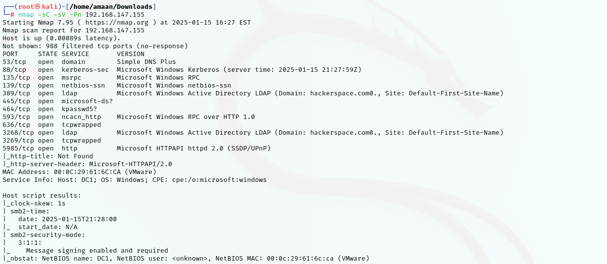
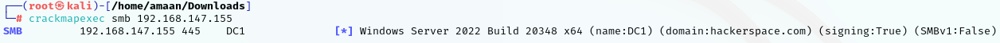
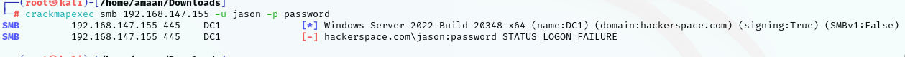
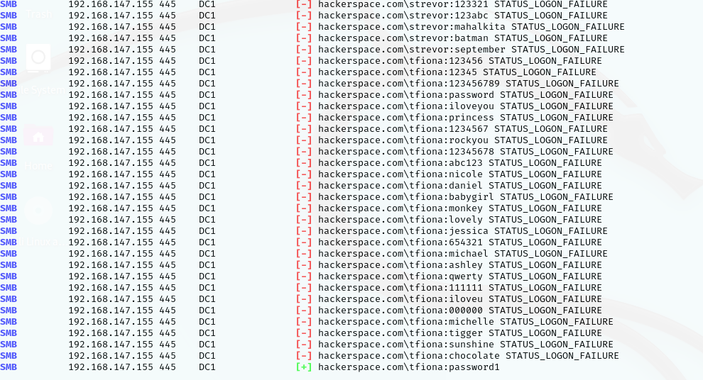
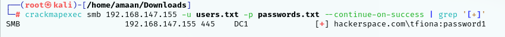

So Now as we have set up our Domain controller for the domain hackerspace.com and also joineda workstation to it. Created some random users created groups and placed those users to random groups. Now as the stage is all set lets dive into the offensive side of this space. Now that we have our users created we will be cracking their passwords or in other words we will be attacking one of domain joined users.

* For that we can use our preffered attack box we want to. I will using the Kali Linux as I feel I ahve good grasp over that OS. 
* The tool we will be using today will be crackmapexec which can be used to to fire off credential against different prortocols such as SMB. It is a very powerfull tool in the domain of Active Directory. There are many other tools in the mordern day era but still crackmapexec does the job.

* Now to set the stage up lets assume that we are doing an penetration test towards the domain that we created. While the pentest we acquired the information about the company and we gathered some data of the employees such as some first name and last name, email addresses etc. 

* I will just grab some usernames from my  domain controller and use them as the potential domain users that will be out users.txt file and remove the Administrator, Guest and the krbtgt usernames from the list. Now we can use this usernames to brute force and try to get the credentials.
* All these users are low-priveleged domain users. We are using low-privileged domain users to understand how when we get inside a organisations structure we can use the very low privileged user and still get what any attacker would require such as running blood hound, if the RDP is open logging in the Remote desktop can be even more brutal.

We know that we have set very weak passwords for our users so instead of using the whole rockyou.txt file we will use the first 200 passwords out of the list. We will create a seperate list for that.


We shall power up our domain and lets ping the domain with nmap and see what results we can get back 
```shell
    nmap -sC -sV -Pn <"IP of the domain">
```



We can see from the scan results that the domain has ldap open smb is open etc. the one we are concerened about is port 445 as this port is by default open on any windows server.

Now using crackmapexec to enumerate the domain controller.
```shell
    crackmapexec smb <"IP of the DC">
```


From the results we can see that it gives us the domain name and the hostname (in our case DC1)

We give a try to use some random username and password and give it to crackmapexec to see how it functions and uses the credentials. 


It tried to login to the domain as it shows "hackerspace.com\jason" but could not as it is the wrong username and password.

* Now lets give it the usernames.txt and the passwords.txt file


After all the bruteforcing we hit one username with the password against the user tfiona. Now lets just get all the usernames that it can crack for us 

```shell
    crackmapexec smb <"Domain IP"> -u users.txt -p passwords.txt --continue-on-success | grep '[+]'
```


So found only one but using the above command we can know what other users are available if crackmapexec cracked them.
