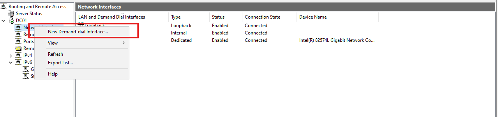

# SITE-SITE VPN DEPLOYMENT

In this blog we will be be configuring a VM in the Azure as a Workstation and we will be setting up our own Site to Site VPN and connect this virtual machine to our on prermise Active Directory.

Outputs from this blog:
* Configuring VPN in On-Premise AD
* Deploying VM on Azure
* Configuring Site-Site VPN
* Connecting the VM to the On-Premise AD

# 1. Configuring VPN in On-Premise AD

We will install some roles and features in our local AD and configure that to setup our local network VPN which we will be using while setting our Azure Site-Site VPN.

 * In the Server Manager we will go to Manage ---> Add Roles and Features ---> Select the RAS Connection manager administration kit in the features section and install it 
 
 * Next we will go to Tools ---> Routing and Remote Access Manager. This will open up the Wizard.
 
 * In the wizard we will go to the Action tab and select the Configure option and select the VPN option.
 
 * In the setup wizard we will select the Custom VPN ---> VPN Access
 
 
 * Right-click the server → Properties → Security tab:
    * Make sure Allow custom IPsec policy for L2TP/IKEv2 connections is checked if you’re planning an IPsec-based connection.
    * Specify the Preshared Key that will match your Azure site’s configuration.(Alternatively, you might configure this in “Demand-dial” interfaces, described below.)
    
* Create a Demand-Dial Interface (for Site‐to‐Site):
    * In the RRAS console, expand Network Interfaces.
    * Right-click Network Interfaces → New Demand-Dial Interface.
    
    * Interface name: Something descriptive, e.g., AzureS2S.
    * Choose Connect using VPN, then pick IKEv2 or L2TP.
    
    
    * Enter the public IP or FQDN of your Azure VPN gateway (you will get this from the Azure side once you create the Virtual Network Gateway).
    * On the Protocol screen, enter your IPsec settings that match Azure (such as preshared key).
    * On the Static Routes page, specify that traffic to 10.0.0.0/16 (example Azure VNet range) should go through this interface.
    * Finish the wizard.
* Allow VPN Traffic Through Windows Firewall (if applicable):
    * The RRAS wizard often creates the needed firewall rules, but double-check that inbound traffic on the necessary ports (UDP 500, UDP 4500, ESP, etc.) is allowed on the RRAS server.

# 2. Deploying Vm on Azure

Deploying VM in Azure

    1. Select the Virtual Machine Icon in the Azure dashboard 
    

    2. Select the option that you would like. I am going with Azure Virtual Machine
    

    3. Configure the Machine however you require and select the image of the worksattion you would like to deploy. In our case I am deploying the Windows 10 Enterprise x64 edition. Keep the rest as default and click Review + create and deploy the machine. 
    

# 3. Configuring Site-Site VPN

    4. To create our own VPN we will follow the steps of creating a resource. We will Select Create Resourse ---> Networking ---> Virtual Network.
    

    5. Create a Gateway Subnet

    * In your newly created Virtual Network, under Subnets, click + Gateway subnet.
    * Accept the default name (GatewaySubnet) and define a small range (e.g., 10.0.1.0/27).
    * Click Save.
    * This subnet is reserved for the VPN gateway we will create next.
    

    6. Creating our Virtual network gateway we will go to the networking section of the Azure services tab and select Virtual network gateway.
    

    7. In the Virtual Network Gateway and click Create.
        * Select the Gateway type as VPN, VPN type as Route-based.
        * Choose SKU (depends on throughput/budget—e.g., VpnGw1).
        * Under Virtual network, select the VNet you created earlier.
        * Under Gateway subnet, pick the GatewaySubnet you created.
        * Provide a Public IP address (create a new one).
        * Click Review + create → Create.
    Note: Deployment can take 30+ minutes.
    
    
    8. Create a Local Network Gateway.
        * Go to Resources ---> Networking ---> Local Network gateway ---> Create.
        * Put in the name in the IP address put your Public facing IP address that you can find using the *https://www.whatismyip.com* website and in the address spaces put in the CIDR of your DC (Mine was 192.168.147.x\24).
        * Click review+create and create the Local Network gateway.
        

    9. Once we are done with that we need go to our RRAS dashboard and in the network interface select the  AzureS2S that we named right click and click connect. This will establish the connection with the Azure VPN and we can see connected.
    
        * And similarly if everything we did goes right we should see the Connected status in our VPN in Azure.
    

# 4. Connecting the VM to the On-Premise AD

* After all the sweat and hardwork the VPN should be up and running. 
* Now lets create a VM on Azure and Connect this VM to our On- premises AD.
* Before creating the VM we will have to point our virtual network to the Domain Controller. For that we will go to our virtual network  and in there we can see the DNS we will select that and Add our DC IP in there and save the settings.

* We follow the usual pattern of creating a VM in the Azure. Selecting the WIndows 10 and in the Network Settings we will be connecting our virtual network that we created and configure the VM accordingly.
* Once our VM is up and running we will RDP in the VM try to ping our DC to see if the VPN is working.

    *AND IT DOES !!!!!*

* Now we will join this Vm to our Domain. To do this we will go the system settings ---> Advanced settings---> Computer Name ---> Select the option of Domain and put  our domain name in there (in my case hackerspace.com)
* Once that is successfull we should see that we are joined to the domain and we should see our welcome screen.

# Errors Faced:

* While I was deploying the Virtual network Gateway I was seeing a second IP Address field in the configuration page. After some troubleshooting and Chat GPT I udnerstood that it happens because of active-active VPN toggle being enabled by Azure automatically. 

* To tackle this it was just to change the generation field and select the one that gives the availability of only one public IP, doing that solved the issue.