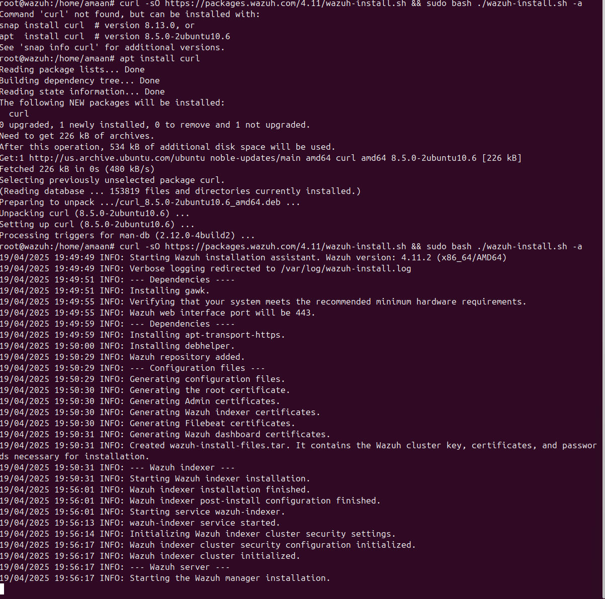
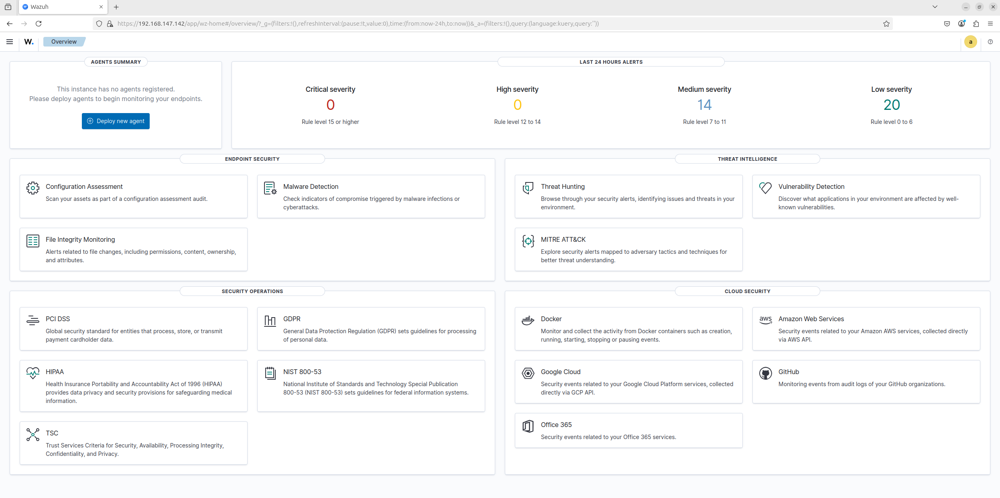

# Installing and Configuring Wazuh Server with Active Directory

## Introduction to Wazuh

Wazuh is an open-source security platform designed to unify threat detection, intrusion detection, and compliance management across diverse infrastructures. It extends the OSSEC project with comprehensive monitoring for file integrity, configuration assessment, and real-time security analytics. Wazuh's modular architecture makes it suitable for a wide range of environments, including on-premises, cloud-based, and containerized deployments. By collecting and analyzing security data from hosts and networks, Wazuh helps organizations swiftly detect malicious activity, automate incident response, and maintain compliance with industry standards.

For my local lab, I am going to download, install, and configure Wazuh on an Ubuntu server. We can configure it in Windows systems as well. I followed the official guide on the Wazuh website:
- Link: https://documentation.wazuh.com/current/quickstart.html

I installed a basic Ubuntu 22.04 in my VMware Workstation and gave it 8GB RAM, 50GB storage, and 2 processor cores, which should be sufficient to handle the server.


## Joining Ubuntu to Active Directory

To join a Debian-based OS to Active Directory requires a different approach than joining Windows systems to AD. We need to install some required tools by running the following command in the terminal:

```bash
sudo apt -y install realmd libnss-sss libpam-sss sssd sssd-tools adcli samba-common-bin oddjob oddjob-mkhomedir packagekit
```

This will install the required packages on the Ubuntu machine.

Next, we will change the hostname of our Ubuntu machine according to our domain name:

```bash
sudo hostnamectl set-hostname hostname.domain.local
```

Change "hostname.domain.local" according to your domain and the hostname you want to give to your server. In my case, it was "wazuh.hackerspace.com"


Now, let's change the DNS settings in our Ubuntu machine. First, we will disable the systemd-resolved service and stop it:

```bash
sudo systemctl disable systemd-resolved.service
sudo systemctl stop systemd-resolved.service
```


Now, let's edit the resolv.conf file and point it towards our domain:

```bash
sudo nano /etc/resolv.conf
```

Edit the nameserver IP with the IP of your Domain Controller.


Once we've made that change, we will use the `realm` command to join the machine to AD. REALM is one of the packages we installed earlier, which is a tool used to join different domains—in our case, Active Directory.

First, let's verify if the Ubuntu server is able to discover our domain:

```bash
sudo realm discover domain.local
```


This shows that we are able to resolve the domain correctly.

To join the machine to the domain, we will use the below command:

```bash
sudo realm join -U Administrator domain.local
```


The `realm list` command will tell us what domain we are joined to.

Now that our machine is joined to the domain, we will set up the authentication. As we can see in the screenshot, the client is using "sssd," which we installed as part of our initial command.

SSSD (System Security Services Daemon) is a central authentication and identity management solution for Linux systems. It seamlessly integrates local hosts with remote directories or identity providers (such as LDAP, Active Directory, or FreeIPA), caching credentials for offline access. By unifying user information and providing a single point of configuration, SSSD simplifies authentication, enhances security, and improves performance across diverse environments.

Since there will be many accounts accessing the Ubuntu machine, we need to set up the home directory configuration for each account when they log in.

**NOTE:** At this point, I advise taking a snapshot of your machine in case anything goes wrong while setting up the home directory configuration. If issues occur, the machine could become unusable, and we would have to start over. Taking a snapshot is good practice before proceeding.

To edit the necessary file, we will use the following command:

```bash
sudo nano /usr/share/pam-configs/mkhomedir
```


We changed the default to "yes" and priority to "900," and also removed the "session [interactive]" restriction.

Once we've made these changes, separate directories will be created for each user whenever they log in.


Now that all the authentication is set up, let's configure SSH for these users so they can have secure shell access when required. For this, we will use the realm command again:

```bash
sudo realm permit
```

After "permit," you can specify users, groups, or individual users to whom you want to grant access.

To give all domain admins in our domain (or any other groups) sudo access on the machine, we can create a separate file named "domainadmins" in the sudoers directory. In that file, we'll add the following line:

```
%domain\ admins@hackerspace.com  ALL=(ALL) ALL
```

After this is done, the domain admins in our domain should have full sudo access on this server.

Now that we have everything in place, we have laid the groundwork for our Wazuh server.

## Installing and Setting Up Wazuh

To set up our own Wazuh server in our home lab or corporate network, we can follow the Wazuh quickstart guide on their website:
https://documentation.wazuh.com/current/quickstart.html

Installing Wazuh consists of setting up 3 components:
1. Wazuh Server
2. Wazuh Indexer
3. Wazuh Dashboard

We can set these up individually, but I am following the basic installation using the single-line command provided in the quickstart guide:

```bash
curl -sO https://packages.wazuh.com/4.11/wazuh-install.sh && sudo bash ./wazuh-install.sh -a
```

This command will download and install the dependencies and packages required, and set up Wazuh for us.



Once Wazuh is installed and configured, the installation will provide us with the username and password to access the dashboard.


We can access the dashboard by visiting https://YOUR_SERVER_IP:443 and providing the username and password.



## Integrating Microsoft Sysmon with Wazuh

Wazuh serves as our unified platform for threat detection, intrusion detection, and compliance monitoring across heterogeneous environments. To enrich its telemetry and extend endpoint visibility, I will integrate Microsoft Sysmon logs into the Wazuh manager. By ingesting and parsing Sysmon event IDs (e.g., process creation 1, network connection 3, DNS query 22), we can define custom decoders and rules so that Wazuh raises high-fidelity alerts whenever suspicious or anomaly-based Sysmon events are captured, thereby tightening endpoint detection and response (EDR) coverage across the estate.

For this, we need to deploy Sysmon on all workstations as a startup script so that all machines have Sysmon installed when they reboot.

We'll go to Group Policy Manager > Right-click at the domain level > Create a new policy > Name it "Sysmon" > Computer Configuration > Windows Settings > Scripts > Startup Scripts > PowerShell scripts, and write a script to install and configure Sysmon.

More information: https://wazuh.com/blog/using-wazuh-to-monitor-sysmon-events/

I have provided a sample sysmon.ps1 code that you can refer to for installing Sysmon as a startup script.

To configure Sysmon to filter events that our Wazuh agent can scan and create alerts for in the Wazuh Dashboard, we will use the latest sysmon.xml file provided by Wazuh itself. Wazuh maintains its own Sysmon XML file with rules to create alerts for all the latest detected vulnerabilities.

More information: https://wazuh.com/blog/

## Deploying Wazuh Agents

Just as we installed Sysmon, we need to install Wazuh agents on our workstations using the same startup script method.

While you can manually download and install the agent on individual workstations, in an enterprise network with hundreds of machines, deploying the Wazuh agent using Group Policy is the most efficient approach.

Once we have deployed the scripts and the agent is installed, we can proceed to configure Wazuh to monitor Sysmon events.

We will follow these steps:

1. Deploy Sysmon and Wazuh using startup scripts
2. Edit the Wazuh ossec.conf file with the following code so that it monitors all events from Sysmon as well:

```xml
<localfile>
    <location>Microsoft-Windows-Sysmon/Operational</location>
    <log_format>eventchannel</log_format>
</localfile>
```

3. Configure the Wazuh manager by editing the local_rules.xml file to match with the Sysmon events being created.

Once we have installed Wazuh on the workstations, it should be available in the installed apps section.


And in our Wazuh manager, we should see our machine as active.


Now that our machine is active, we can see the dashboard with all the information that Wazuh has collected about it.


To see a better view of our vulnerabilities, we can click on the Vulnerability section of the machine and see all the severe vulnerabilities our machine has, and create alerts accordingly.


## Conclusion

With Wazuh now fully integrated into our Active Directory environment—collecting Sysmon telemetry, correlating it with host and network data, and surfacing high-fidelity alerts in the dashboard—we have laid the groundwork for a mature, end-to-end detection-and-response pipeline. 

From here the focus shifts to **continuous tuning**: refine Sysmon XML filters to cut noise, expand Wazuh decoders and rules for new threat techniques, and integrate ticketing or SOAR hooks to automate containment and remediation. Periodic vulnerability scans, purple-team simulations, and dashboard reviews will ensure that Wazuh remains aligned with evolving adversary tactics and organizational risk. 

In short, this deployment is not a finish line but a foundation—one that equips us to detect faster, respond smarter, and satisfy compliance mandates as our infrastructure grows.